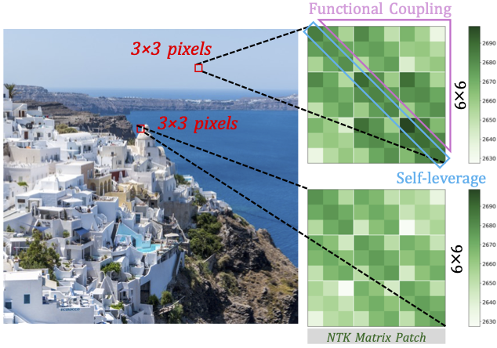

# NTK-Guided Implicit Neural Teaching

[Chen Zhang*](https://chen2hang.github.io), [Wei Zuo*](https://scholar.google.com/citations?user=AonK3NEAAAAJ&hl=en), Bingyang Cheng, Yikun Wang, Wei-Bin Kou,
[Yik-Chung Wu](https://www.eee.hku.hk/~ycwu/), [Ngai Wong](https://www.eee.hku.hk/~nwong/)

[[`Paper`](https://chen2hang.github.io/_publications/ntk_guided_implicit_neural_teaching/CVPR_2026_Paper.pdf)] | [[`Project Page`](https://chen2hang.github.io/_publications/ntk_guided_implicit_neural_teaching/nint.html)]

This is the official PyTorch implementation of the **[CVPR 2026]** paper: **[NTK-Guided Implicit Neural Teaching](https://arxiv.org/pdf/2511.15487)**.

## Intro & Key Features

**NINT** is a principled, plug-and-play sampling framework that accelerates **Implicit Neural Representation (INR)** training by leveraging the **Neural Tangent Kernel (NTK)**. 
NINT effectively identifies coordinates that maximize global functional updates by capturing both *local fitting errors* (**Self-leverage**) and *complex coordinate coupling* (**Functional Coupling**), representing a *state-of-the-art* INR training acceleration paradigm.

<p align="center">
  
</p>

**State-of-the-Art Acceleration**: Reduces required training iteration and time by up to **26.58%** and **48.99%**.

**NTK-Aware Selection**: Moves beyond simple error-based sampling by scoring points via their "self-leverage" and "functional coupling".

**Plug-and-Play**: Compatible with various network architectures and data modalities (Image, Audio, 3D).

---

## Getting Started

### 1. Environment Setup

```bash
conda env create -f environment.yml
conda activate nint_env
```

### 2. Training (Quick Start)

Train images (using 5 images from [DIV2K dataset](https://data.vision.ee.ethz.ch/cvl/DIV2K/) in `/images` as examples) with a default SIREN network architecture:

```bash
python train_image.py
```

Outputs (models and logs) are saved to `outputs/`.

### 3. Advanced Usage

Configure your training via `config/train_image.yaml`:

```yaml
DATASET_CONFIGS:
  file_path: path/to/your/image.png

TRAIN_CONFIGS:
  iterations: 5000

nint:
  mt_ratio: 0.2
  batch_size_scheduler: constant
  sample_interval: dense

WANDB_CONFIGS:
  use_wandb: 1
  wandb_project: YOUR_PROJECT
  wandb_entity: YOUR_USERNAME
```

### 4. Reproducibility

Results are reproducible when seed is fixed:
```yaml
TRAIN_CONFIGS:
  seed: 42
```

---


## Related works
Related works for developing a deeper understanding of NINT are: <br>
<p class="indented">[ICLR 2026] <a href="https://chen2hang.github.io/_publications/nonparametric_teaching_of_attention_learners/ICLR_2026_Paper.pdf">Nonparametric Teaching of Attention Learners</a>,</p>
<p class="indented">[ICML 2025 Spotlight] <a href="http://arxiv.org/pdf/2505.14170">Nonparametric Teaching for Graph Property Learners</a>,</p>
<p class="indented">[ICML 2024] <a href="https://arxiv.org/pdf/2405.10531">Nonparametric Teaching of Implicit Neural Representations</a>,</p>
<p class="indented">[NeurIPS 2023] <a href="https://arxiv.org/pdf/2311.10318">Nonparametric Teaching for Multiple Learners</a>,</p>
<p class="indented">[ICML 2023] <a href="https://arxiv.org/pdf/2306.03007">Nonparametric Iterative Machine Teaching</a>.<br></p>


##  Citation
If you find our work useful in your research, please cite:
```bibtex
@inproceedings{zhang2026nint,
  title={NTK-Guided Implicit Neural Teaching},
  author={Zhang, Chen and Zuo, Wei and Cheng, Bingyang and Wang, Yikun and Kou, Wei-Bin and Wu, Yik-Chung and Wong, Ngai},
  booktitle={CVPR},
  year={2026}
}
```

## Acknowledgment
We thank the authors of the following works for releasing their codebases:
- [INT](https://github.com/chen2hang/INT_NonparametricTeaching)
- [Soft Mining](https://github.com/ubc-vision/nf-soft-mining)
- [EVOS: Efficient Implicit Neural Training via EVOlutionary Selector](https://github.com/zwx-open/EVOS-INR)
- [Expansive Supervision for Neural Radiance Fields](https://github.com/zwx-open/Expansive-Supervision)

## Contact Us
Please feel free to contact us: [Wei Zuo](https://scholar.google.com/citations?user=AonK3NEAAAAJ&hl=en) or [Chen Zhang](https://chen2hang.github.io) if you have any questions while starting up NINT.